# Backend Development｜後端開發

本文件介紹 K8s Deploy Tool 的後端架構、核心部署流程與工程設計。

後端使用 **Java、Spring Boot 與 MySQL** 建立，負責 Kubernetes 部署專案的設定管理、Template 與 Config 管理、部署資產渲染，以及 Deployment Package 打包。

除了 REST API 與資料持久化，後端也涵蓋 Authentication、Role-based Authorization、Project Hierarchy、Version-based Resource Management、Custom Template、Deployment Asset Rendering、Artifact Push Task 與 Kubernetes Workload Image Usage Scan。

> **Public Documentation Notice｜公開文件說明**
>
> 本文件使用抽象化的模組名稱與流程圖，不包含實際 API Endpoint、Entity 欄位、Database Schema、Registry Host、Cluster Address、Credential、Storage Path、Project Identifier 或公司內部部署腳本內容。

---

# Documentation Navigation｜文件導覽

- [Project Overview｜專案總覽](./README.md)
- [Frontend Development｜前端開發](./Frontend.md)
- [Application Monitoring & Observability｜應用監控與可觀測性](./Observability.md)

---

# Backend Overview｜後端概述

後端平台涵蓋以下主要領域：

| Domain | Backend Responsibilities |
|---|---|
| Authentication and Authorization | 驗證 JWT、解析使用者角色並保護管理 API。 |
| Project Group | 管理 Project 的上層組織與操作邊界，並提供部分預設行為。 |
| Project Hierarchy | 管理單一部署 Project、MULTI_MODULE Parent Project 與 Child Module Project 的關係。 |
| Project Configuration | 管理 DEV、UAT、PROD 環境設定、資源選擇與 Project Files。 |
| Template | 管理 Public Template、Project Custom Template、版本、驗證與 Rendering Strategy。 |
| Artifact | 管理可部署資源、版本、狀態、Registry Reference 與使用關係。 |
| Registry | 封裝 OCI Manifest、Tag、Digest、Platform Metadata 與 Registry Synchronization。 |
| Deployment | 解析 Project Hierarchy 與環境設定，渲染部署資產並產生 Deployment Package。 |
| Artifact Push Task | 建立及執行 Registry Synchronization Task，保存狀態、錯誤與持久化結果。 |
| Image Management | 掃描 Kubernetes Workload Image，並與平台管理版本建立使用關係。 |
| Storage | 分離可查詢 Metadata 與 Binary Content，支援 Template、Project Resource 與 Package Lifecycle。 |
| Operation History | 保存 Deployment 與外部操作的執行狀態、結果與錯誤資訊。 |

後端的核心工作不只是提供 CRUD API，而是將 Project、Template、Values、Config Files 與受管理的 Artifact Version 組合成可預覽、可保存及可打包的部署設定。

---

# Technology Stack｜技術棧

| Category | Technology | Usage |
|---|---|---|
| Language and Application Framework | Java, Spring Boot | 建立 REST API、Domain Logic、Validation、Persistence、Transaction 與外部系統整合。 |
| Security | Spring Security, OAuth 2.0 Resource Server, JWT | 驗證使用者身分並執行 Role-based Authorization。 |
| Database | MySQL | 保存 Resource Metadata、Version Relationship、Project Configuration、Task State 與 Deployment History。 |
| Registry Integration | Harbor, OCI-compatible Registry | 解析 OCI Artifact、Manifest、Digest、Platform，並執行 Registry Synchronization。 |
| Container Platform | Kubernetes | 產生 Kubernetes 部署所需資產，並查詢 Workload Image Usage。 |

Helm、Dockerfile、YAML 與 Shell Script 在本平台中屬於 Deployment Asset，因此在後續 Rendering 與 Deployment Package 章節中說明，而不拆成獨立的主要後端技術分類。

本文件著重技術的實際用途與設計關係，因此不特別強調 Framework 或 Runtime 的小版本號。

---

# Backend Structure｜後端目錄結構

後端以業務領域拆分主要模組。以下為公開文件使用的抽象化結構，不代表實際 Package、Class 或檔案名稱：

```text
backend/src/main/java/
├── artifact/       # Managed resources and version lifecycle
├── template/       # Public/custom template validation and rendering
├── project/        # Project group, hierarchy and environment configuration
├── deployment/     # Resource resolution, rendering and packaging
├── registry/       # OCI integration and artifact push workflow
├── kubernetes/     # Workload image discovery and usage analysis
├── storage/        # Metadata and binary content coordination
├── security/       # JWT authentication and authorization
├── common/         # Shared exception, response and utility logic
└── configuration/  # Application and infrastructure configuration
```

每個 Domain Module 內部再依需求包含 API、Application Service、Domain Logic、Persistence 與 Infrastructure Integration，使功能可以依業務能力擴充，而不需要將所有 Controller、Service 或 Repository 集中在大型共用目錄中。

---

# Overall Backend Architecture｜後端整體架構

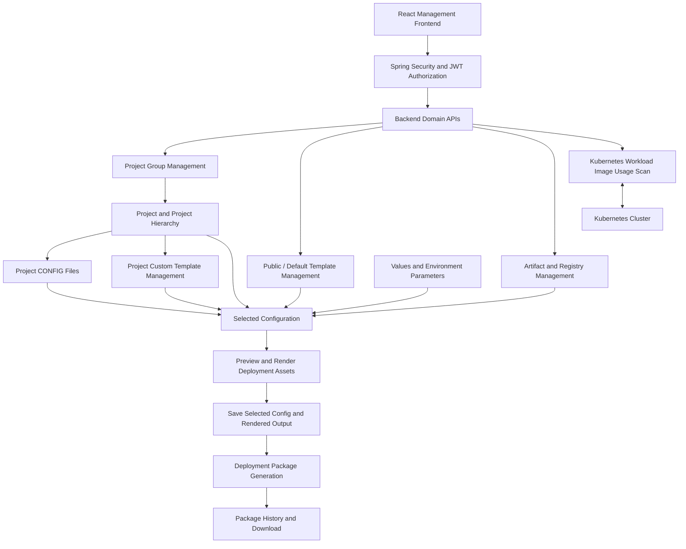

平台的主要流程是先建立 Project Group 與 Project，再上傳 Project CONFIG Files。使用者可選擇系統管理的 Public / Default Template，或上傳 Project Custom Template，並在 Selected Configuration 中組合 Template、Values、Config Files、Base Image 與其他環境設定。

Selected Configuration 提供 Preview / Render，用於檢查 Helm、Dockerfile 與 Shell 等部署資產。正式保存後，系統會保留目前選定的設定與 Rendered Output；後續執行 **Deploy** 時，會依已保存的 Selected Config 與 Project Files 產生完整 Deployment Package，並提供歷史查詢與下載。

> **Deployment boundary｜部署責任邊界**
>
> 本平台中的 **Deploy** 指產生與打包 Kubernetes 部署專案，不代表後端會直接對 Kubernetes Cluster 執行 `kubectl` 或 `helm deploy`。目前與 Kubernetes 的直接互動僅限於查詢 Workload Image Usage；實際部署由產出的 Package 在平台外執行。

---

# Authentication and Authorization｜登入與權限

後端作為 OAuth 2.0 Resource Server，驗證前端送出的 JWT，並使用 Role-based Authorization 保護管理功能。

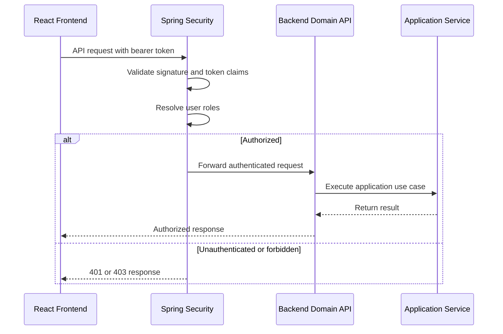

主要設計包含：

- OAuth 2.0 Resource Server
- JWT Authentication
- Role-based Authorization
- Protected Management API
- Unauthorized and Forbidden Response Handling
- External Credential Configuration Injection

前端 Route Guard 用於改善導覽與操作體驗，但真正的 API 存取控制仍由後端執行。Registry、Kubernetes 與其他外部系統 Credential 由執行環境注入，不寫死於 Source Code，也不記錄在公開文件或操作 Log 中。

---

# Core Domain Modules｜核心領域模組

## Project Group and Project Hierarchy｜Project Group 與 Project 階層

Project Group 是 Project 的組織與操作邊界；Project 才是實際部署設定與 Package Generation 的單位。MULTI_MODULE Parent Project 則用於聚合多個 Child Module Project，與 Project Group 是不同概念。

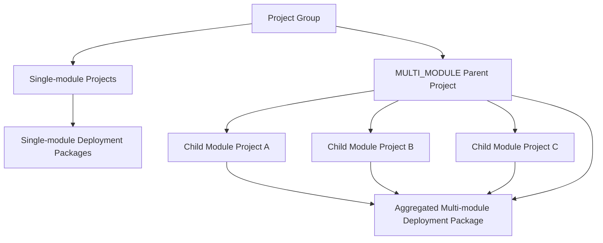

主要規則包括：

- 每個 Project 只屬於一個 Project Group，同一 Group 內的 Project Name 必須唯一。
- Project Group 仍包含 Project 時不能刪除，仍包含 Enabled Project 時不能停用。
- Child Module 必須與 MULTI_MODULE Parent 位於同一個 Project Group，並使用一致的 Namespace。
- Child Module 需要有效且唯一的 Relative Project Path；Parent 仍包含 Child 時不能刪除。

> **Important clarification｜重要區分**
>
> **Project Group** 是 Project 的組織容器；**MULTI_MODULE Parent Project** 才是多模組 Deployment Package 的聚合根節點。

---

## Project and Environment Configuration｜Project 與環境設定

每個 Project 可以維護 DEV、UAT、PROD 三組獨立的 Selected Configuration，同時共用 Project 所擁有的 Template、Config Files 與其他可選資源。

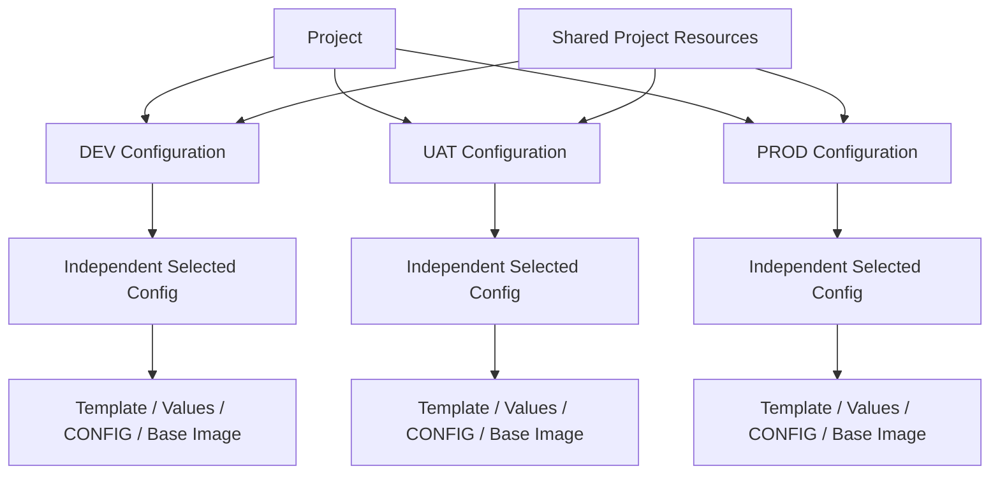

三個環境使用相同的設定模型，但各自保存獨立的 Template Source、Version、Values、Project Files、CONFIG Resources 與 Base Image Selection。修改單一環境時，不會覆蓋其他環境的設定。

---

## Template Management｜模板管理

平台管理 Helm、Dockerfile 與 Shell Template，並將 Template Source 明確區分為 Public / Default 與 Project Custom。

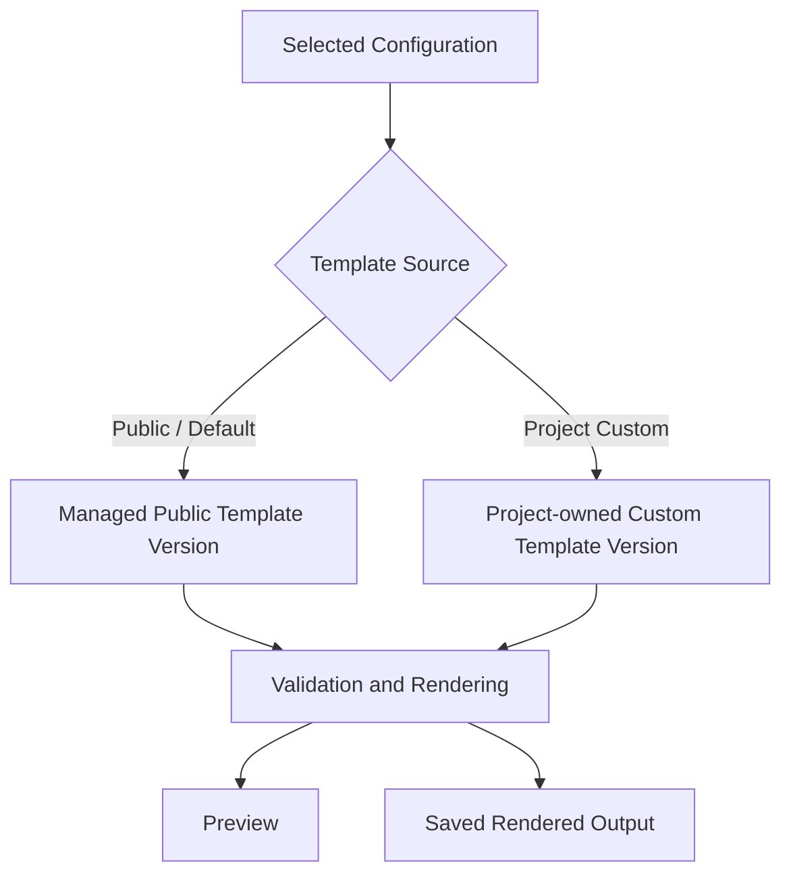

Project Custom Template 具有 Project Scope 與 Local Version。Preview 只讀取並渲染內容，不修改已保存的部署輸出；Custom Template 仍被 Selected Configuration 使用時，也不能直接刪除。

---

## Artifact and Registry Management｜Artifact 與 Registry 管理

Artifact 以 Version 為單位管理 Container Image、Base Image 與其他受控資源，並保存 Registry Reference、Digest、Platform 與使用狀態。

Registry Module 封裝 Harbor 與 OCI-compatible Registry 的 Manifest Resolution、Tag Synchronization、Multi-platform Metadata 與 Artifact Push Flow，避免其他 Domain 直接依賴底層 Registry API。

---

## Kubernetes Image Management｜Kubernetes Image 管理

後端會查詢 Kubernetes Workload 實際使用的 Container Image，並與平台管理的 Artifact Version 建立比對關係。

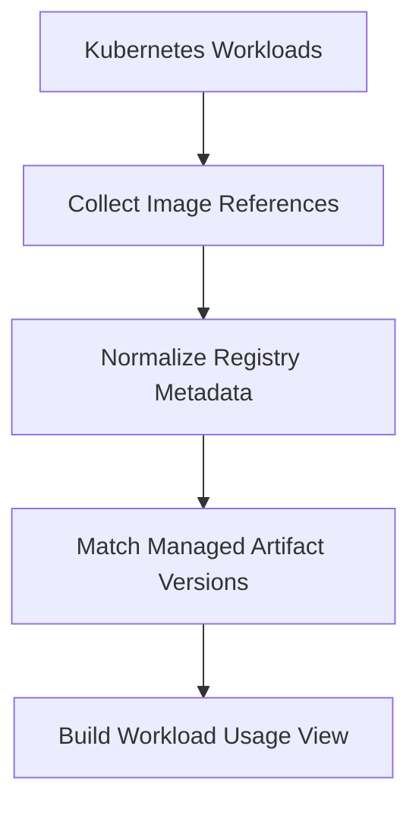

此功能用於了解叢集中的 Image Usage、版本差異與資源使用關係，不會觸發 Kubernetes Deployment 或修改 Cluster Resource。

---

# Deployment Package Generation｜部署套件產生

Deployment Package Generation 是平台的核心輸出流程。單一 Project 產生自己的 Package；MULTI_MODULE Parent Project 則聚合 Child Module Project 的部署資產。

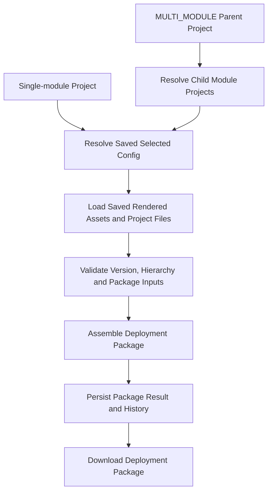

Project Group 不直接參與 Package Generation；對 Multi-module Project 而言，MULTI_MODULE Parent Project 才是 Aggregation Root。

## Selected Config Preview and Save｜設定預覽與保存

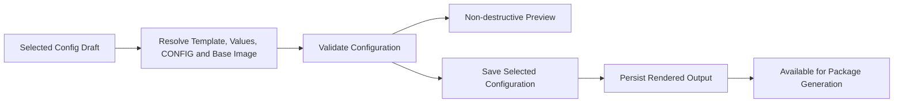

Preview 與 Save 共用相同的 Resolution、Validation 與 Rendering Rule。Preview 不改寫正式輸出；只有 Save 成功後，才保存 Selected Configuration 與對應的 Rendered Asset。

## Package Assembly｜套件組裝

按下 **Deploy** 時，系統會讀取已保存的 Selected Config、Rendered Assets 與 Project Files，組裝成標準化 Deployment Package，並保存 Package Metadata 與執行歷史。

平台內部 Storage Layout 與最終 Package Structure 分離，使內部儲存方式可以演進，同時維持穩定的輸出契約。

> **Deploy does not execute Kubernetes deployment｜Deploy 不代表直接部署叢集**
>
> 此流程只產生可供 Kubernetes 部署使用的 Package，不會直接執行 `kubectl apply`、`helm install` 或其他 Cluster Write Operation。

---

# Artifact Push Task｜Artifact 推送任務

Registry Synchronization 可能包含 Manifest Resolution、多平台映像處理與 Registry Transfer，不適合將完整流程綁定在單次同步 HTTP Request 中。

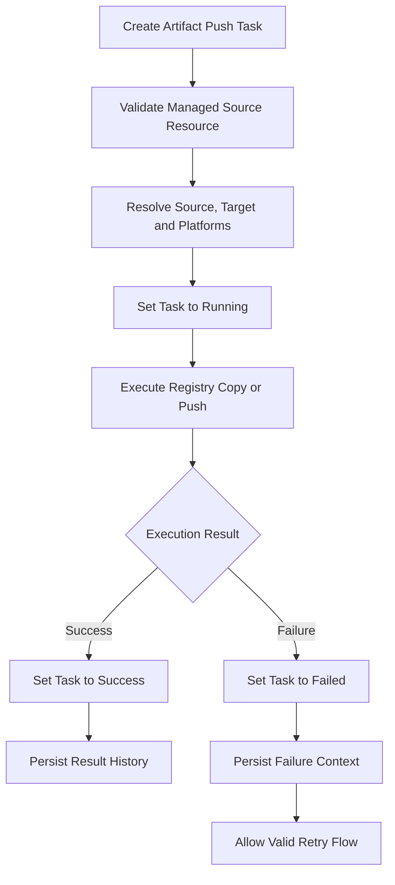

| Status | Backend Meaning |
|---|---|
| PENDING | Task 已建立，等待符合條件的執行操作。 |
| RUNNING | Registry Operation 正在執行，限制重複觸發或不合理狀態變更。 |
| SUCCESS | 外部操作完成，保存結果與必要的 Metadata Snapshot。 |
| FAILED | 操作失敗，保存可理解的 Failure Context 並判斷是否允許 Retry。 |

後端將目前可操作的 Task State 與長期保存的 Push History 分開管理。即使暫時性的 Task 後續被清理，成功或失敗的操作結果仍可用於 Audit、Troubleshooting 與使用者查詢。

---

# Storage Architecture｜儲存架構

平台採用 Metadata 與 Binary Content 分離的設計，Business Domain 不直接依賴實際 File System Path。

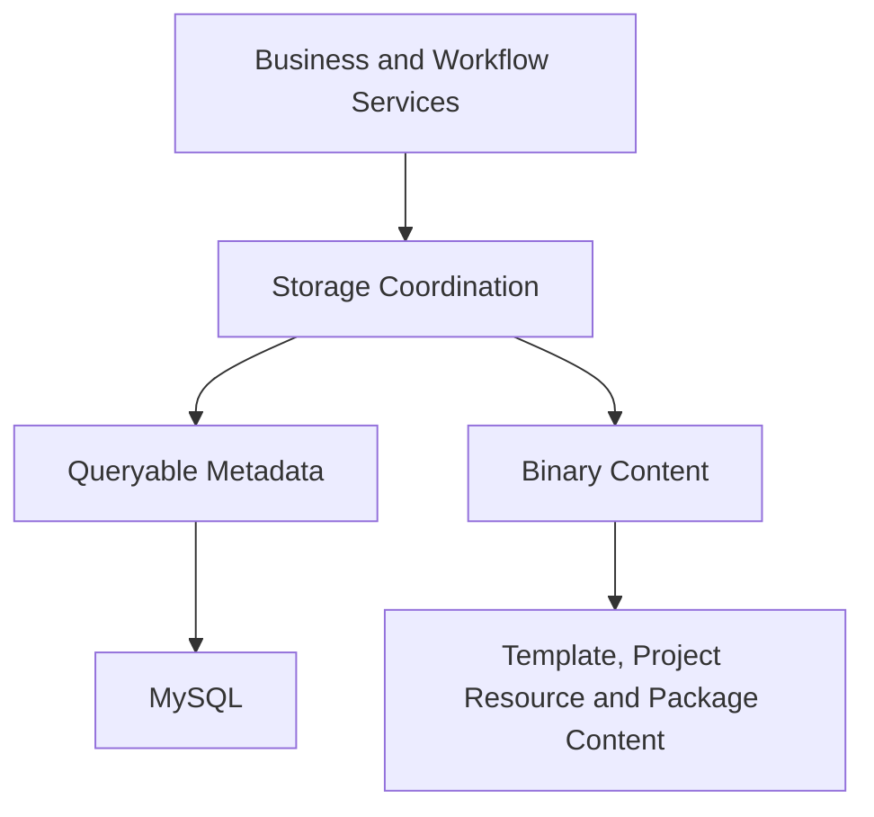

Database 保存 Resource Ownership、Version Relationship、Storage Reference、Status 與 Deployment Relationship；Binary Content 則由 Storage Layer 統一處理 Upload、Preview、Download、Copy、Delete 與 Package Output。

Business Service 只透過 Storage Reference 取得內容，不自行拼接或依賴實際儲存路徑。這讓 Binary Lifecycle、Naming Rule 與 Storage Implementation 可以獨立演進，而不需要重寫主要 Deployment Workflow。

公開文件不列出實際 Entity 欄位、Table Name、Foreign Key、Index、Folder Name 或 Storage Path Rule。

---

# Validation and Error Handling｜驗證與錯誤處理

後端將基本輸入驗證與需要 Domain Context 的商業驗證分開處理。

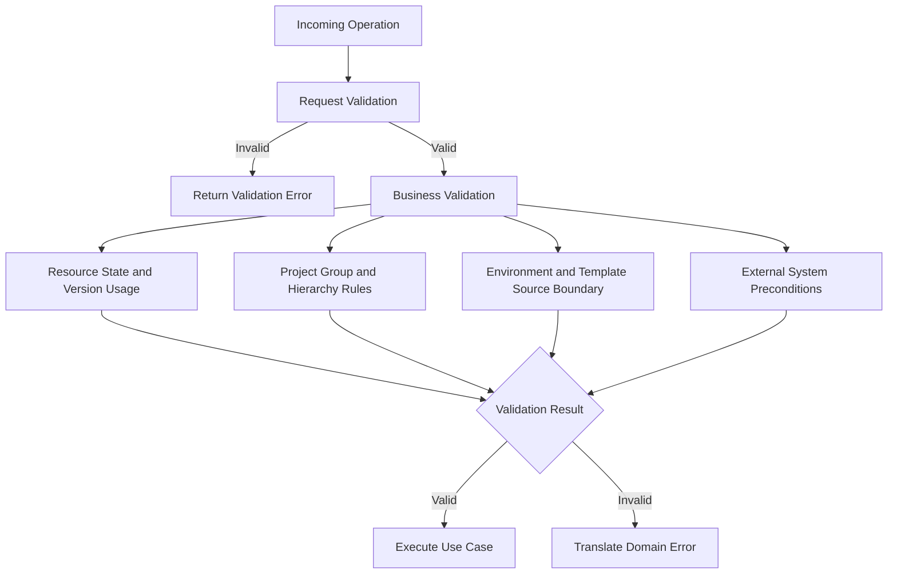

## Validation Strategy｜驗證策略

- **Request Validation**：檢查必要輸入、格式、Enum 與基本限制。
- **Business Validation**：檢查資源狀態、版本相依、使用關係、Project Hierarchy、環境邊界、Template Source 與外部系統條件。

具體情境包括：

- Project Group 在仍包含 Project 時不能刪除。
- Project Group 在仍包含 Enabled Project 時不能停用。
- Disabled Project Group 不能建立新的 Enabled Project。
- MULTI_MODULE Parent Project 在仍包含 Child Module 時不能刪除。
- Child Module 必須符合 Group、Namespace 與 Relative Path Rule。
- Custom Template 仍被 Environment Configuration 選用時不能刪除。
- Artifact 或 Template Version 仍被 Project Configuration、Deployment History 或 Workload 使用時不能移除。

## Error Handling｜錯誤處理

後端透過統一 Exception Handling 將不同模組的錯誤轉換成一致的 API Error Response。

常見錯誤類型包含：

- Resource Not Found
- Duplicate Resource
- Invalid State Transition
- Invalid Project Hierarchy
- Version or Template Still in Use
- Invalid Template Package
- External Registry Failure
- Kubernetes Access Failure
- Storage Operation Failure
- Unauthorized or Forbidden Operation

前端可以依照 HTTP Status 與 Error Message 顯示穩定且可理解的操作回饋；底層 Stack Trace、Internal Host、Credential 與外部 Client Detail 不直接暴露給使用者。

---

# Transaction and Consistency｜交易與一致性

修改 Database State 的流程使用 Transaction 維持一致性；同時涉及 Registry Synchronization 或 Binary Storage 的長時間操作，則不將完整外部流程綁定在單一 Database Transaction 中。

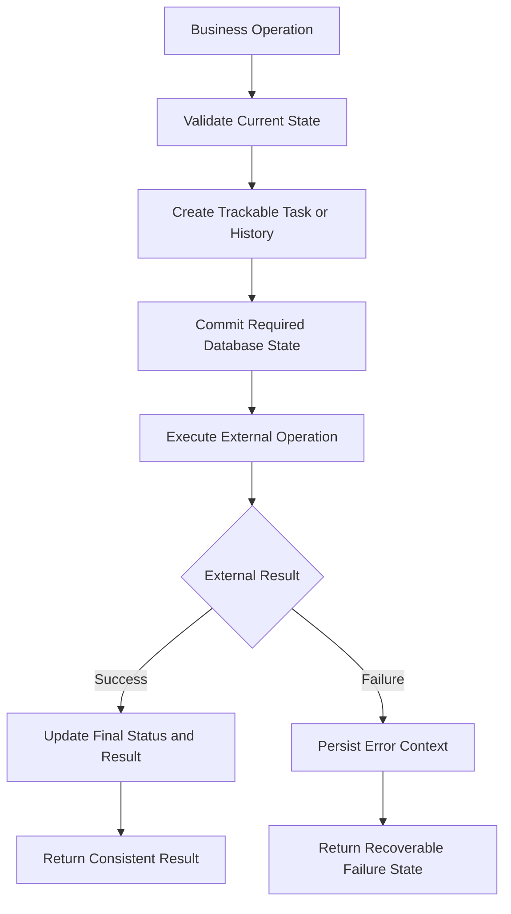

主要原則包括：

- 執行具有副作用的操作前先驗證目前狀態。
- 先建立可追蹤的 Task 或 History Record。
- Database Transaction 只涵蓋可由資料庫控制的狀態變更。
- 外部操作完成後再更新最終狀態與結果。
- 失敗時保存 Error Context，而不是只回傳一次性錯誤。
- 刪除與更新前檢查 Version、Hierarchy 與 Template Usage。
- 環境設定更新只影響目標 Environment。
- Preview 不改寫正式 Environment Output。

此設計不假設 Database Transaction 可以回滾 Registry 或 Binary Storage，而是透過狀態、歷史與明確的操作順序管理跨系統一致性。

---

# Backend Engineering Decisions｜後端工程設計決策

- **Project Group and deployment hierarchy separation**  
  Project Group 負責 Project 組織與操作邊界；MULTI_MODULE Parent Project 負責 Multi-module Package Aggregation，避免將兩種不同責任混為同一模型。

- **Version-based resource model**  
  Artifact 與 Template 透過新版本保存變更，而不是直接覆蓋既有內容，使 Deployment 可以引用明確版本並保留 Traceability。

- **Public and custom template source separation**  
  Public Template 與 Project Custom Template 使用明確的 Template Source，確保 Preview、Save、Render 與 Delete 使用正確的內容生命週期。

- **Non-destructive custom template preview**  
  Custom Template Preview 不改寫 Environment Output；只有正式保存設定時，才更新可部署的 Rendered Asset。

- **Environment as an explicit domain boundary**  
  DEV、UAT、PROD 使用獨立的 Selected Configuration，局部修改不會覆蓋其他環境的資源選擇。

- **Domain-oriented module design**  
  後端依 Artifact、Template、Project、Deployment、Registry 與 Storage 等業務能力拆分，而不是只依 Controller、Service、Repository 技術層集中管理。

- **Thin controller and service orchestration**  
  Controller 處理 HTTP Boundary；Business Rule、Version Resolution 與跨模組流程由專責 Service 協調。

- **Runtime-specific template strategy**  
  不同 Runtime 與 Package Type 保留各自的 Validation 與 Build Logic，避免單一 Generic Template 隱藏必要差異。

- **Shared preview and package rendering rules**  
  Preview 與正式 Package Generation 共用 Resource Resolution、Validation 與 Rendering Rule，降低輸出不一致風險。

- **Internal storage and package output separation**  
  平台內部 Storage Layout 不等同 Runtime Package Structure，Packaging Layer 負責維持穩定輸出契約。

- **Managed OCI references**  
  Base Image 與 Deployment Artifact 由受管理的 Artifact Version 選擇，不使用未受控的自由文字 Image Reference。

- **Task and persistent history separation**  
  Task 表示目前執行狀態與可用操作，History 保存長期 Audit、Result 與 Failure Context。

---

# Engineering Challenges｜工程挑戰

| Challenge | Approach | Result |
|---|---|---|
| Project Group and Multi-module Concept Separation | 將組織容器與部署聚合根節點建模為不同概念。 | Project 分組不會錯誤介入 Multi-module Package Generation。 |
| Multi-module Hierarchy Validation | 驗證 Parent Type、Group、Namespace、Relative Path 與 Child Usage。 | 避免跨 Group 掛載、路徑衝突與不完整的 Aggregated Package。 |
| Project Custom Template Isolation | 明確追蹤 Public / Custom Template Source，並建立 Project-local Version 與 Delete Protection。 | 避免 Public Template、Custom Content 與 Environment Output 互相覆蓋或誤刪。 |
| Cross-domain Deployment Orchestration | 使用專責 Deployment Workflow 依序完成 Resolution、Validation、Rendering、Packaging 與 Result Persistence。 | 集中跨模組規則，並讓 Preview 與 Package Generation 共用一致邏輯。 |
| External System Consistency | 將 Registry Synchronization 與 Package Storage 等外部操作建模為可追蹤流程，保存中間狀態與 Failure Context。 | 不需要維持長時間 HTTP Connection 或將外部流程包在單一 Database Transaction 中。 |
| Version Usage Validation | 將使用關係驗證到 Version Level，整合 Project Configuration、Deployment History 與 Workload Usage。 | 能精確阻擋仍在使用中的版本，同時避免限制未被使用的版本。 |
| Multi-environment Configuration | 將 Environment 視為明確資料邊界，每次只解析及更新目標環境。 | 降低 DEV、UAT、PROD 設定互相覆蓋或交叉使用的風險。 |
| Preview and Package Consistency | 共用 Resolution、Validation 與 Rendering Service，而不是分別實作兩套規則。 | 使用者預覽內容與正式產出採用相同 Domain Logic。 |
| Registry Multi-platform Artifact | 解析 OCI Manifest 與 Platform Metadata，並將 Source、Target 與 Platform Selection 納入 Task Validation。 | 能以受管理且可追蹤的方式處理不同 Image Platform。 |
| Storage and Business Data Coupling | Business Domain 只保存 Storage Reference，檔案生命週期由 Storage Layer 處理。 | Storage Implementation 與路徑規則可以獨立調整，不需重寫核心流程。 |
| Stable Error Contract | 將 Validation、Domain 與 Infrastructure Exception 統一轉換為可理解的 API Error Response。 | 前端能建立一致的 Error Feedback，同時避免暴露內部實作資訊。 |

---

# Backend Contributions｜後端主要貢獻

- 使用 Java 與 Spring Boot 建立 Artifact、Template、Project、Deployment、Registry 與 Storage 等後端功能。
- 建立 Spring Security OAuth 2.0 Resource Server、JWT Authentication 與 Role-based Authorization。
- 設計 Project Group 與 Project 的組織及操作限制。
- 建立 MULTI_MODULE Parent Project、Child Module Project 與 Multi-module Package Generation Workflow。
- 實作 Parent / Child 的 Group、Namespace、Relative Path 與 Delete Constraint Validation。
- 建立 DEV、UAT、PROD 多環境 Project Configuration 與資源選擇流程。
- 設計並實作 Public Template 與 Project Custom Template 的 Source Separation。
- 建立 Project Custom Template Upload、Local Version、Preview、Selection 與 Delete Protection。
- 設計並實作 Artifact 與 Template 的 Version-based Resource Management。
- 實作 Deployment Resource Resolution、Business Validation、Asset Rendering 與 Package Generation。
- 讓 Preview 與正式 Package Generation 共用相同的 Domain Rule。
- 整合 Harbor、OCI-compatible Registry 與 Binary Storage，並建立 Kubernetes Workload Image Query。
- 實作 OCI Manifest、Digest 與 Multi-platform Image Metadata 處理。
- 建立受管理的 Docker Base Image 與 Artifact Version Selection。
- 建立 Artifact Push Task、Status Transition、Retry Validation 與 Persistent Result History。
- 實作 Kubernetes Workload Image Usage Scanning 與 Artifact Version Matching。
- 建立 Version-level Usage Validation 與刪除保護。
- 分離 Storage Metadata、Binary Content 與 Business Workflow。
- 建立一致的 Validation、Exception Translation 與 API Error Response。
- 整理可公開的後端架構、流程圖與工程決策文件。

---

# What I Learned｜開發經驗

透過此專案，我對後端工程的理解從 REST API 與 Database CRUD，延伸到完整的 Platform Backend Design：

- 上層組織容器與部署階層可能看起來相似，但必須依責任分成不同 Domain Model。
- Project Group 解決組織與操作限制；MULTI_MODULE Parent Project 解決多模組部署聚合，兩者不能混用。
- Project Hierarchy Validation 必須同時考慮 Parent Type、Group Boundary、Namespace 與 Relative Path。
- Public Template 與 Project Custom Template 需要明確的 Source 與 Lifecycle Boundary，才能避免 Preview、Save 與 Delete 操作互相干擾。
- Non-destructive Preview 能讓使用者驗證內容，同時維持已保存 Environment Output 的穩定性。
- Version Management 不只是保存歷史，也決定 Deployment 是否能被確認、追蹤與重現。
- DEV、UAT、PROD 不只是 Enum 或前端 Tab，而是 Project Configuration 的實際 Domain Boundary。
- Deployment Package Generation 的核心是 Project Hierarchy、Resource Resolution、Dependency Validation、Rendering 與 Packaging 的順序管理。
- Database Transaction 無法涵蓋 Registry Synchronization 與 Binary Storage，跨系統一致性需要 Task State、History 與 Error Context。
- Task 與 Persistent History 解決不同問題：前者呈現目前執行狀態，後者保存長期結果與診斷資訊。
- Storage Abstraction 的重點是讓 Business Domain 不依賴實際路徑或 Binary Backend。
- Validation 與 Error Handling 是部署流程的一部分，會直接影響系統能否安全地阻擋錯誤操作並提供可理解的回饋。

This backend demonstrates practical experience in Spring Boot application design, project hierarchy modeling, multi-module deployment orchestration, project-scoped template versioning, security, OCI integration, asynchronous task modeling, storage abstraction, and CI/CD platform engineering.

本後端實作展示了 Spring Boot Application Design、Project Hierarchy Modeling、Multi-module Deployment Orchestration、Project-scoped Template Versioning、Security、OCI Integration、非同步任務模型、Storage Abstraction 與 CI/CD Platform Engineering 等實務經驗。
