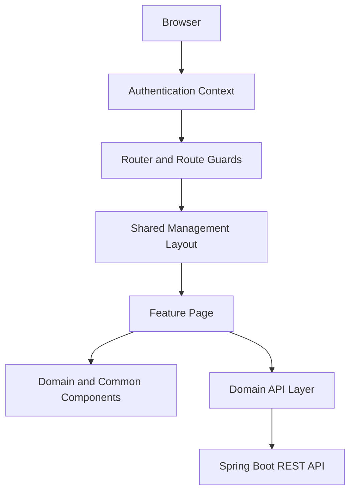
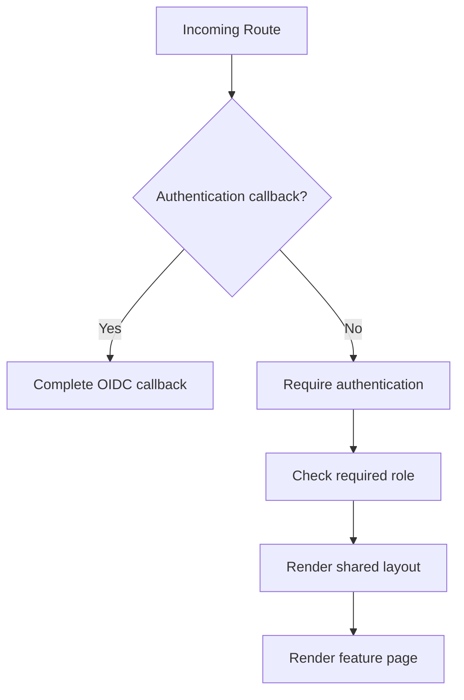
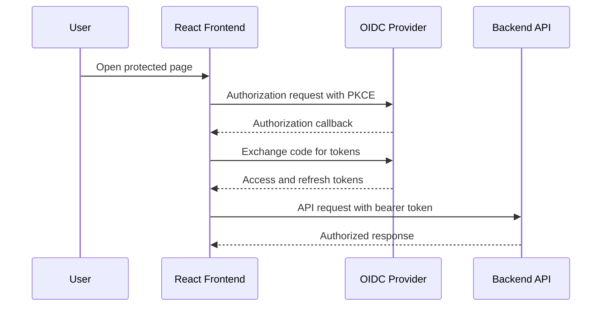
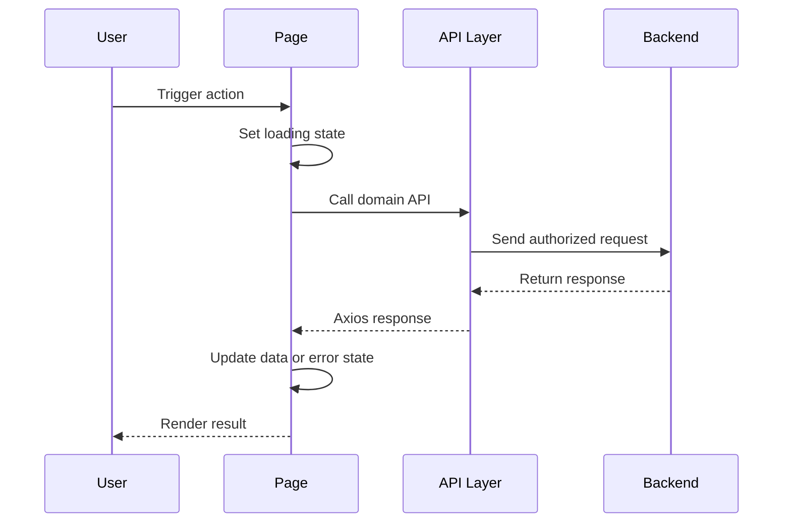
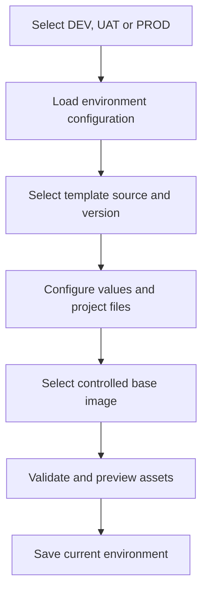
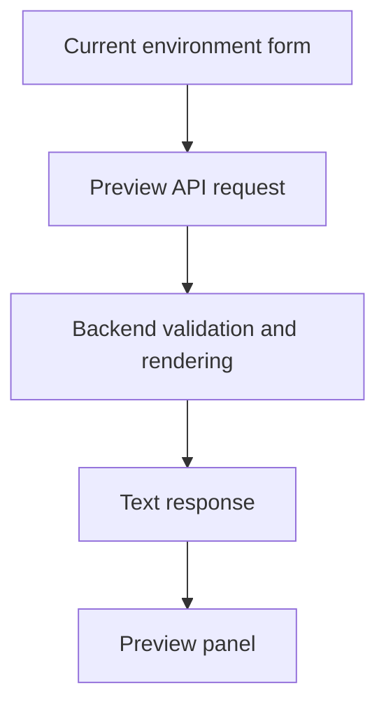
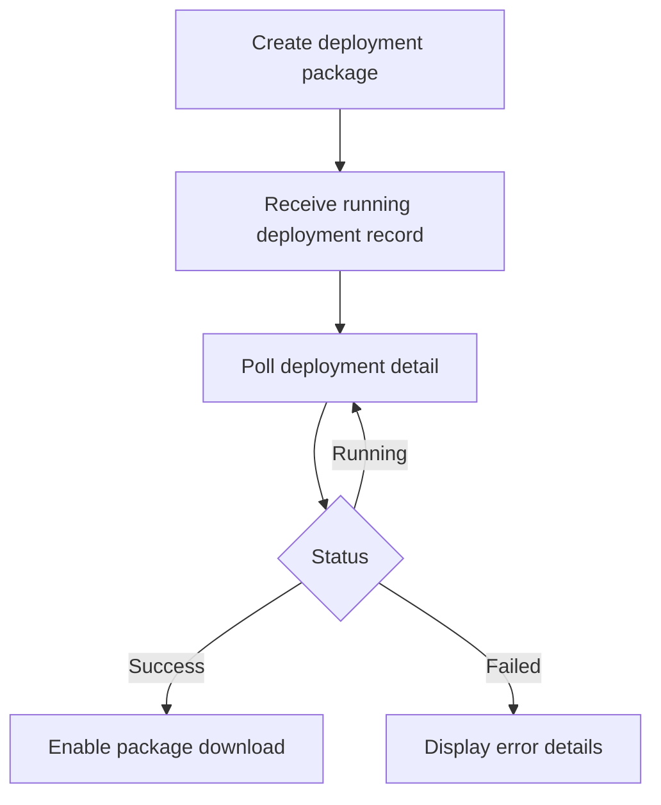

# Frontend Development｜前端開發

本文件介紹 K8s Deploy Tool 的前端架構、核心管理流程與工程設計。

前端使用 **React、TypeScript 與 Vite** 建立，負責將 Registry、OCI Artifact、Deployment Template、多環境設定與 Kubernetes Delivery 等技術概念，轉換成可操作、可驗證且具備狀態回饋的 Web 管理介面。

除了資料呈現與表單操作，前端也涵蓋 Authentication、Role-based Routing、API Contract、Deployment Asset Preview、非同步任務追蹤、檔案下載與錯誤處理。

> **Public Documentation Notice｜公開文件說明**
>
> 本文件使用抽象化的功能名稱與流程圖，不包含實際 Identity Provider Endpoint、Registry Host、Namespace、Project Identifier、Credential 或其他環境識別資訊。

---

# Documentation Navigation｜文件導覽

- [Project Overview｜專案總覽](./README.md)
- [Backend Development｜後端開發](./Backend.md)
- [Application Monitoring & Observability｜應用監控與可觀測性](./Observability.md)

---

# Frontend Overview｜前端概述

前端管理平台涵蓋以下主要領域：

| Domain | Frontend Responsibilities |
|---|---|
| Authentication | 登入導向、Callback、Token Lifecycle、使用者狀態與 Route Protection。 |
| Registry | Registry 查詢、建立、編輯、啟用狀態與內部 Registry 選擇。 |
| Artifact | Artifact Explorer、Tag Detail、Version、Digest 與 Platform Information。 |
| Artifact Push Task | Task 建立、執行、Retry、狀態顯示、Detail 與 Persistent Log。 |
| Template | Helm、Dockerfile、Shell Template 與 Version 的管理、上傳、下載及預覽。 |
| Project | Project Group、Project、Project File、Custom Template 與環境設定。 |
| Deployment | Deployment Asset Preview、Package Generation、狀態追蹤與結果下載。 |
| Image Management | Kubernetes Workload Image Usage、Outdated Image 與 Cleanup Candidate 顯示。 |

前端的核心工作不是單純顯示後端資料，而是將具有先後依賴的選擇、驗證與非同步操作整理成一致的使用者流程。

---

# Technology Stack｜技術棧

| Technology | Usage |
|---|---|
| React 18 | 建立管理頁面、互動流程與可重用元件。 |
| TypeScript | 定義 Domain Model、API Contract、Component Props、Form State 與 Enum。 |
| Vite | Development Server、Environment Configuration、API Proxy 與 Production Build。 |
| React Router | Nested Routing、Authentication Guard、Role Guard 與頁面導覽。 |
| Axios | REST API、Authorization Header、Text Preview、Blob Download 與錯誤處理。 |
| Zustand | 管理跨元件共用的前端狀態。 |
| Bootstrap | 管理介面排版、表單與視覺樣式。 |
| React Dropzone | Template 與 Project File 的拖放上傳互動。 |
| Ant Design Icons | 共用操作 Icon 與狀態視覺提示。 |

---

# Frontend Structure｜前端目錄結構

前端依照應用程式責任拆分主要目錄：

```text
front/src/
├── api/          # Domain API functions and request types
├── auth/         # Authentication context and route guards
├── components/   # Common, layout, modal and domain components
├── layout/       # Shared application layout
├── pages/        # Route-level feature pages
├── types/        # Shared TypeScript domain models
├── APP.tsx       # Route composition
└── main.tsx      # Application entry point
```

這種結構將 Route-level Page、可重用 Component、API Communication、Authentication 與 Type Definition 分開，使功能可以依 Domain 擴充，而不需要將所有邏輯集中在單一頁面中。

---

# Overall Frontend Architecture｜前端整體架構



各層的主要責任如下：

| Layer | Responsibility |
|---|---|
| Authentication Context | 管理登入狀態、Token、目前使用者與登出流程。 |
| Router and Guards | 組合 Route，並在頁面進入前檢查登入與角色。 |
| Shared Layout | 提供 Top Navigation、Side Navigation、Breadcrumb 與內容區域。 |
| Feature Page | 管理查詢條件、Page State、Modal、Loading、Error 與操作流程。 |
| Domain Component | 封裝具有業務語意的 Selector、Configuration Panel 與 Detail View。 |
| Common Component | 提供 Modal、Pagination、Status Badge 與 Inline Loading 等通用 UI。 |
| Domain API Layer | 定義 Endpoint、HTTP Method、Request、Response 與下載格式。 |

此設計讓 Page Component 專注於使用者流程，不需要自行處理 OIDC 細節、共用 Axios 設定或整體版型。

---

# Routing and Navigation｜路由與導覽

平台使用 Nested Routing 組合管理功能，並將 Authentication、Authorization 與 Layout 放在不同路由層級。



主要路由群組包含：

- Home
- Project Group and Project
- Deployment
- Registry
- Artifact Explorer
- Image Management
- Artifact Push Task and Log
- Helm Template
- Dockerfile Template
- Shell Template

`RequireAuth` 負責確認登入狀態，`RequireRole` 負責檢查頁面所需權限。Side Navigation 也會依照目前角色顯示對應入口，但真正的存取控制仍由 Route Guard 與後端 Authorization 共同執行，不能只依賴隱藏選單。

Shared Layout 統一管理：

- Top Navigation
- Side Navigation
- Breadcrumb
- Current Route State
- Nested Page Content

當 Route 改變時，頁面會更新導覽資訊，避免 Detail Page、List Page 與上一個功能的 Breadcrumb 互相殘留。

---

# Authentication and Authorization｜登入與權限

平台使用 OAuth 2.0 / OpenID Connect Authorization Code Flow with PKCE，並與 OIDC-compatible Identity Provider 整合。



前端 Authentication Flow 包含：

- 產生 PKCE Verifier、Challenge 與 State。
- 導向 Identity Provider 進行登入。
- 在 Callback 驗證 State 並交換 Authorization Code。
- 解析 JWT 中的使用者資訊與角色。
- 將不同來源的 Role 資訊轉換成平台使用的權限模型。
- 透過 Axios Interceptor 加入 Bearer Token。
- 在 Token 即將失效時執行 Refresh Flow。
- Refresh 失敗或收到未授權回應時清除登入狀態。
- 使用 Authentication Guard 與 Role Guard 保護管理頁面。

Callback Flow 也會避免同一組 Authorization Code 因 React Development Mode 的重複 Effect 而被交換兩次。

### Responsibility Boundary｜責任邊界

前端 Route Guard 用於改善導覽與操作體驗，但不取代後端權限驗證。後端仍會驗證 JWT 與角色，避免使用者繞過前端後直接呼叫受限制的 API。

---

# Frontend Request Flow｜前端請求流程



Page Component 主要負責：

- 收集使用者輸入與查詢條件。
- 管理 List、Detail、Selected Item 與 Modal State。
- 控制 Loading、Saving、Preview 與 Error State。
- 呼叫對應 Domain API Function。
- 操作完成後重新載入受影響的資料。

API Layer 主要負責：

- Endpoint Path 與 HTTP Method。
- Query Parameter 與 Request Body。
- TypeScript Request / Response Type。
- JSON、Text、Blob 與 Paginated Response Configuration。
- 共用 Axios Client 與 Authorization Header。

前端 API Function 保留完整的 `AxiosResponse`，由呼叫端明確取得資料：

```ts
const response = await loadResources();
setResources(response.data);
```

不同 Response 類型會採取不同處理方式：

| Response Type | Frontend Handling |
|---|---|
| JSON DTO | 更新 List、Detail 或 Form State。 |
| Paginated JSON | 處理 Content、Page、Size 與 Total Elements。 |
| Plain Text | 顯示 Rendered Helm、Dockerfile 或 Shell Preview。 |
| Blob | 建立 Deployment Asset 或 Package Download。 |

---

# Feature Modules｜功能模組

## Registry and Artifact Explorer｜Registry 與 Artifact Explorer

Registry Management 提供 Registry 的建立、編輯、查詢與啟用狀態管理。Artifact Explorer 則以 Registry、Artifact 與 Tag 的層級呈現 OCI Artifact，並提供版本、Digest 與 Platform Detail。

主要互動包含：

- Registry List、Detail 與 Enable / Disable。
- Registry-based Artifact Navigation。
- Artifact Tag 與 Version Detail。
- Digest 與 OCI Platform Information。
- Artifact Push 或 Retry Entry Point。
- Search、Filter 與 Pagination。

前端將 Registry 的階層式資料轉換成可逐層探索的管理流程，並在列表與詳細資料之間維持目前查詢條件及選擇狀態。

---

## Template Management｜Template 管理

平台分別管理 Helm、Dockerfile 與 Shell Template。每一種 Template 都具有自己的版本、檔案內容、Metadata 與 Validation Requirement。

前端提供：

- Template List、Create、Update 與 Delete。
- Template Version Upload、List、Detail、Download 與 Delete。
- 共用 Template Version List 與 Detail Modal。
- Public Template 與 Project Custom Template 選擇。
- Version-dependent Default Values Loading。
- Rendered Content Preview 與 Download。

Dockerfile Template 還需要呈現 Runtime Type、Package Type、JDK / Runtime Mode 與其他 Template Metadata，使使用者能選擇符合目標服務的版本，而不是將所有 Runtime 視為同一種模板。

---

## Project and Project Files｜Project 與檔案管理

Project Module 將 Project Group、Project Metadata、Project File、Custom Template 與 Selected Configuration 整合在同一個 Detail Workflow。

Project File 支援不同用途與環境可用範圍，包括：

- ConfigMap
- Secret
- ENV Usage
- MOUNT Usage
- Manifest-related Resource

前端需要同時表達「檔案在哪些環境可用」以及「目前部署設定屬於哪個環境」，這兩個概念不能混為同一個欄位。

---

## Multi-environment Project Configuration｜多環境專案設定

Project Selected Configuration 是前端最核心的複合操作流程之一。使用者可以在 DEV、UAT、PROD 之間切換，分別選擇 Template、Version、Values、Project Files 與 Docker Base Image。



### Environment Isolation｜環境隔離

前端的 Deployment Environment Type 僅允許：

```ts
type DeployEnvironmentType = 'DEV' | 'UAT' | 'PROD';
```

Project File 可以標記為 `ALL`，代表 DEV、UAT、PROD 都可以選用該檔案；但 Selected Configuration 實際保存時仍必須屬於其中一個明確環境。

因此前端會分開處理：

- **File Availability**：Project File 可在哪些環境使用。
- **Deployment Ownership**：這筆 Selected Configuration 實際屬於哪個環境。

切換環境時，前端會載入對應的 Template、Values 與 Config File Selection。儲存時只更新目前環境，避免 DEV、UAT、PROD 互相覆蓋。

### Dependent Selection｜相依選擇

Template Source、Template、Version、Default Values、Base Image 與 Preview 具有先後依賴。當上游選擇改變時，前端會清除已失效的下游 State，避免舊 Version 或 Preview 被誤認為仍然有效。

不同 Template 的設定需求也有所差異：

- Helm 整合 Values、ConfigMap、Secret、ENV、MOUNT 與 Manifest Resource。
- Dockerfile 需要選擇平台管理且可用的 Base Image Version。
- Shell 包含 Helm Wait 與部署完成條件等執行參數。
- Public Template 與 Project Custom Template 使用不同的 Version Loading Flow。

修改其中一種 Template Configuration 時，前端會保留同環境下其他 Template 的既有設定，避免局部編輯意外覆蓋完整設定。

---

## Deployment Asset Preview｜部署資產預覽

使用者在產生 Deployment Package 前，可以先預覽後端根據目前環境設定渲染的內容：

- Helm Manifest
- Dockerfile
- Shell Script



Preview 不由前端自行模擬 Template Rendering，而是將目前選擇交給後端，以與正式 Package Generation 相同的 Domain Rule 產生內容。這能降低前後端渲染邏輯不一致的風險。

當 Template、Version、Values 或 Base Image 改變時，前端會清除舊 Preview，要求使用者重新產生，避免顯示已過期的結果。

---

## Deployment Package and History｜部署套件與歷史

前端可以建立 Deployment Package、追蹤產生狀態、查看 Deployment Detail，並在成功後下載結果檔案。



Package Generation 為背景工作，因此前端不會將單次 HTTP Request 視為完整執行結果，而是透過 Deployment Record ID 查詢狀態，直到成功或失敗。

此流程提供：

- Creating / Running Feedback
- Polling and Status Refresh
- Success / Failure Result
- Error Message Display
- Deployment Detail
- Generated Package Download

---

## Artifact Push Task｜Artifact 推送任務

Registry Artifact 操作可能需要較長執行時間，因此使用 Task-oriented UI 呈現執行狀態、可用操作與歷史資訊。

| Task Status | Frontend Behavior |
|---|---|
| PENDING | 提供 Execute 與 Delete 操作。 |
| RUNNING | 顯示執行中狀態，並避免重複操作。 |
| SUCCESS | 顯示完成結果與相關 Metadata。 |
| FAILED | 顯示 Failure Reason，並提供 Retry。 |

前端使用 Task ID 管理單筆 Row Loading State，避免執行一個 Task 時鎖住整張列表。操作完成後會重新整理 Task List；若 Detail Modal 已開啟，也會同步更新 Detail，避免兩個區域顯示不同狀態。

Task 用於呈現目前工作狀態，Persistent Push Log 則保存可長期查詢的執行結果與 Metadata Snapshot。前端將兩者分成不同頁面與互動目的。

---

## Kubernetes Image Management｜Kubernetes Image 管理

Image Management Page 將 Kubernetes Workload Image Usage 與平台內管理的 Artifact Version 進行對照，協助使用者理解：

- Workload 目前使用的 Image 與 Tag。
- Image Version 是否落後於平台管理版本。
- Artifact 與 Workload 的使用關係。
- 可以進一步檢查的 Cleanup Candidate。
- Base Image 更新到可用版本的操作入口。

前端負責呈現掃描結果、Filter、Status 與操作回饋；實際 Kubernetes Query、Digest Matching 與版本分析由後端處理。

---

# Reusable Components｜共用元件

前端將純 UI 行為與 Domain-specific Workflow 分開，以避免共用元件承擔過多業務規則。

## Common Components｜通用元件

| Component | Responsibility |
|---|---|
| Modal | 提供一致的開關、標題、內容與操作區域。 |
| Status Badge | 顯示 Task、Artifact、Deployment、Environment、Platform 與 Enabled State。 |
| Pagination | 統一 Page、Size、Total 與切頁互動。 |
| Inline Loading | 在保留既有內容時顯示背景更新狀態。 |
| Common Icons | 統一 Edit、Delete、Download、Retry 與 Preview 等操作視覺。 |

## Domain Components｜領域元件

| Component | Responsibility |
|---|---|
| Base Image Selector | Search、Registry Filter、Pagination 與 Base Image Version Selection。 |
| Template Version List | 共用 Template Version List 與操作入口。 |
| Template Version Detail | 顯示 Version Metadata 與下載操作。 |
| Project File Table | 顯示 File Kind、Usage、Environment 與選擇狀態。 |
| Project Selected Config Panel | 顯示各環境目前保存的 Template 與設定摘要。 |
| Project Selected Config Modal | 管理 Template、Version、Values、Files、Base Image 與 Preview。 |
| Task / Deployment Detail | 呈現狀態、時間、錯誤與執行結果。 |

Domain Component 保留特定業務語意，Common Component 則維持通用且穩定的 Props Boundary。這樣能提高重用性，同時避免把 Template、Environment 或 Task Rule 寫進純 UI 元件。

---

# Interaction and Feedback Patterns｜互動與回饋模式

## Modal Responsibility｜Modal 責任分工

Page Component 通常管理：

- Modal 是否開啟。
- Create / Edit / Detail Mode。
- Selected Item。
- 操作成功後的 List 或 Detail Refresh。

Modal Component 通常管理：

- Form Initialization。
- Dependent Field State。
- Validation Error。
- Saving、Preview 與 API Error State。
- Submit Request 與 Success Callback。

這個分工讓 Modal 可以獨立處理完整表單流程，而 Page 仍保留資料集合與導覽控制權。

## Loading State｜載入狀態

平台依操作範圍使用不同層級的 Loading Feedback：

| Level | Usage |
|---|---|
| Page Loading | 初次載入主要頁面資料。 |
| Inline Loading | 保留現有畫面並更新列表或部分資料。 |
| Row Loading | 執行、Retry 或刪除單一項目。 |
| Modal Loading | 載入 Detail、Default Values 或相依選項。 |
| Saving State | 表單送出期間 Disable 重複提交。 |
| Preview State | Rendered Asset 產生期間顯示明確回饋。 |

## Error Handling｜錯誤處理

前端依錯誤發生位置提供不同回饋：

- Page Load Error
- Form Validation Error
- Save / Delete Error
- Preview Generation Error
- File Download Error
- Asynchronous Task Failure
- Authentication Expiration

API Error 不只顯示通用失敗訊息；若後端提供可公開給使用者的 Failure Reason，Task Detail 或 Deployment Detail 會在對應操作情境中呈現。

## Event Handling｜事件處理

可點擊 Table Row 中可能同時包含 Edit、Retry、Download 或 Delete 等按鈕。這些按鈕會阻止事件向 Row 傳遞，避免開啟非預期的 Detail：

```ts
event.stopPropagation();
```

---

# Frontend Engineering Decisions｜前端工程設計決策

- **Authentication concentrated in context and guards**  
  登入、Token 與 Role 判斷集中管理，避免每個 Page 重複處理驗證流程。

- **Authorization enforced at multiple layers**  
  Navigation、Route Guard 與 Backend Authorization 各自負責呈現、路由與 API 安全，前端隱藏按鈕不被視為真正的權限控制。

- **Domain-oriented API modules**  
  API Function 依 Registry、Artifact、Template、Project 與 Deployment 拆分，使 Endpoint 與 Type 能跟隨 Domain 演進。

- **Explicit TypeScript contracts**  
  Request、Response、Enum 與 Nullable Field 透過明確型別描述，降低前後端 DTO 不一致造成的 Runtime Error。

- **Environment as an explicit domain boundary**  
  DEV、UAT、PROD 不是單純畫面 Tab，而是 Project Configuration 的資料邊界；File Availability 的 `ALL` 與實際 Deployment Environment 分開處理。

- **Backend-rendered preview**  
  前端不複製 Helm、Dockerfile 或 Shell Rendering Rule，而是使用後端 Preview API，確保預覽與正式 Package Generation 使用一致邏輯。

- **Per-item asynchronous feedback**  
  Row Action 使用單筆 Loading State，Task 與 Deployment 則依持久化狀態更新 UI，避免以全頁鎖定處理所有長時間操作。

- **Common UI and domain component separation**  
  Modal、Pagination 與 Status Badge 保持通用；Base Image Selector、Template Version 與 Project Configuration 則保留 Domain Rule。

---

# Engineering Challenges｜工程挑戰

| Challenge | Approach |
|---|---|
| OIDC Callback 與 Token Lifecycle | 使用 PKCE、State Validation、Token Refresh、Axios Interceptor 與 Route Guard 建立完整流程。 |
| 不同 API Response Format | 分別處理 JSON、Paginated JSON、Text Preview 與 Blob Download。 |
| DEV / UAT / PROD 設定隔離 | 依目前環境載入及保存資料，避免切換或局部修改時覆蓋其他環境。 |
| Template 相依選項 | 上游選擇改變時清除失效的 Version、Values、Base Image 或 Preview State。 |
| Public / Custom Template | 依 Template Source 載入不同 Version，同時維持一致的設定介面。 |
| 長時間 Registry Operation | 使用 Task Status、Row Loading、Failure Reason、Retry 與 Persistent Log 提供回饋。 |
| Deployment Package Background Job | 使用 Deployment Record 與 Polling 追蹤成功或失敗，而不是依賴單一長連線。 |
| List and Detail Consistency | 操作完成後同步刷新受影響的 List、Detail、Pagination 與 Selected Item。 |
| Reusable Component Boundary | 將純 UI 與包含業務規則的 Domain Component 分開。 |

---

# Frontend Contributions｜前端主要貢獻

我參與了此管理平台的前端設計、功能實作與重構，主要內容包括：

- 建立 React、TypeScript 與 Vite 的管理介面及頁面導覽架構。
- 實作 OAuth 2.0 / OpenID Connect with PKCE、Token Lifecycle 與 Role-based Route Protection。
- 建立依 Domain 拆分的 Axios API Layer，處理 JSON、Pagination、Text Preview 與 Blob Download。
- 實作 Registry、Artifact Explorer、Template、Project、Deployment、Push Task 與 Image Management 等頁面。
- 實作 DEV、UAT、PROD 多環境 Project Selected Configuration Workflow。
- 實作 Template Version、Base Image、Project File、Values 與 Preview 的相依選擇流程。
- 建立 Deployment Asset Preview、Package Status Polling 與 Download Interaction。
- 建立 Task-oriented UI，包括 Status、Retry、Failure Reason、Row Loading 與 Persistent Log。
- 重構 Modal、Status Badge、Pagination、Inline Loading 與 Template Version 等共用元件。
- 整理 Loading、Error、Event Propagation 與 List / Detail Refresh 等一致性互動模式。

---

# What I Learned｜開發經驗

透過此專案，我對前端工程的理解從單一頁面與 API 串接，延伸到完整的管理平台設計：

- Authentication 不只是登入按鈕，而是 Callback、Token Refresh、Unauthorized Handling 與 Route Protection 的完整生命週期。
- TypeScript 不只是基本型別檢查，也能用來表達 Environment、Template、Task Status 與 API Contract 等 Domain Rule。
- 複雜表單的核心是管理資料依賴與失效條件，而不是單純增加更多 State。
- Preview、Loading、Error 與 Retry 是部署管理流程的一部分，會直接影響使用者是否能判斷操作結果。
- 非同步 Task 與 Persistent History 解決的是不同問題，前端需要分別呈現即時狀態與長期紀錄。
- 可重用元件的價值來自清楚的責任與 Props Boundary，而不是只將程式碼拆成更多檔案。
- 前後端必須共同維護 Authentication、DTO、Enum、Validation 與 Error Response，才能建立穩定的操作流程。

This frontend demonstrates practical experience in full-stack integration, authentication, type-safe API design, multi-environment configuration, asynchronous workflow UX, and reusable component architecture.

本前端實作展示了 Full-stack Integration、Authentication、Type-safe API Design、多環境設定、非同步工作流程 UX 與可重用元件架構等實務經驗。
