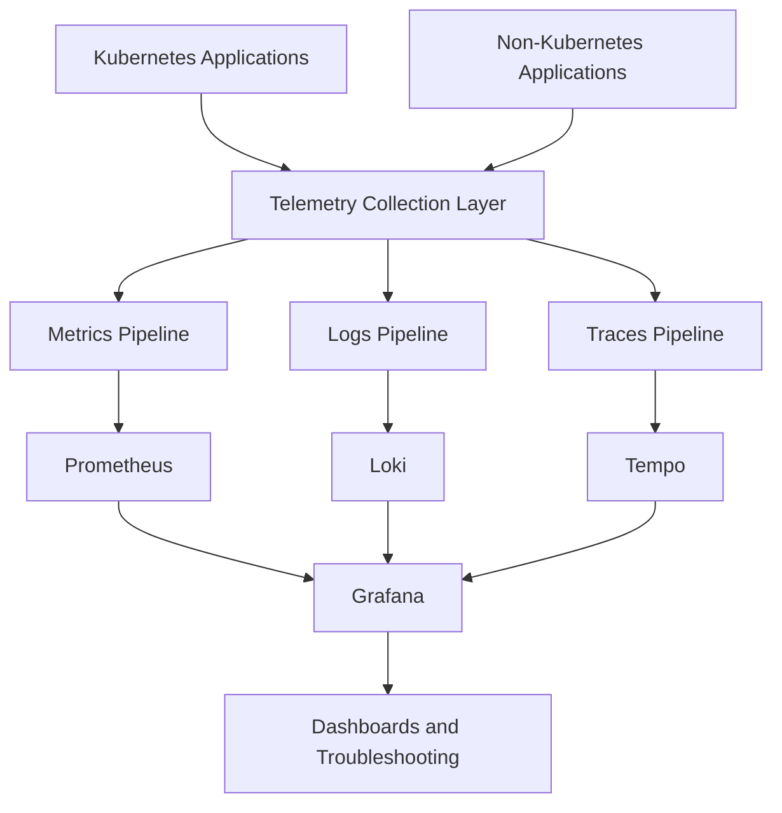
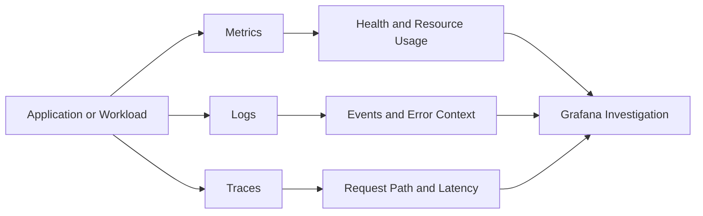
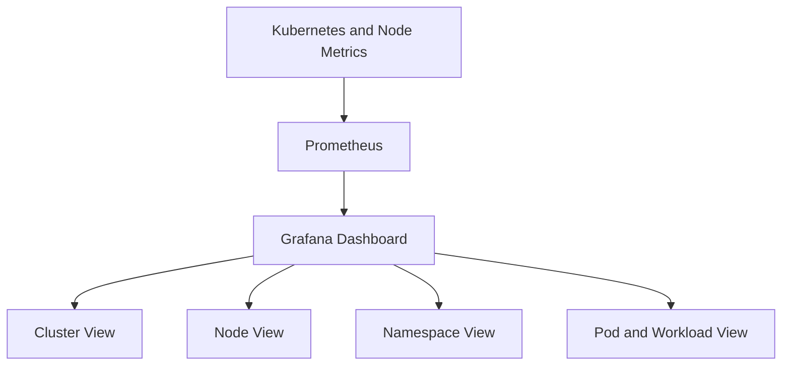
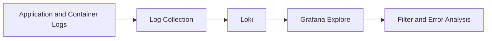
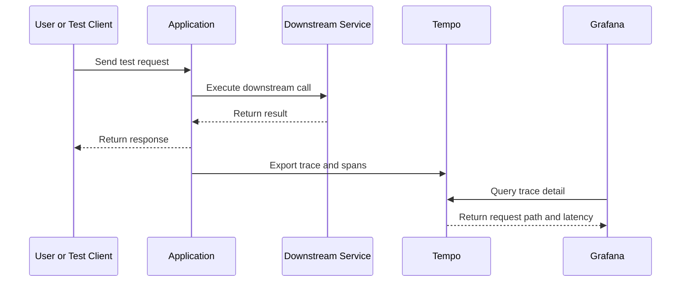
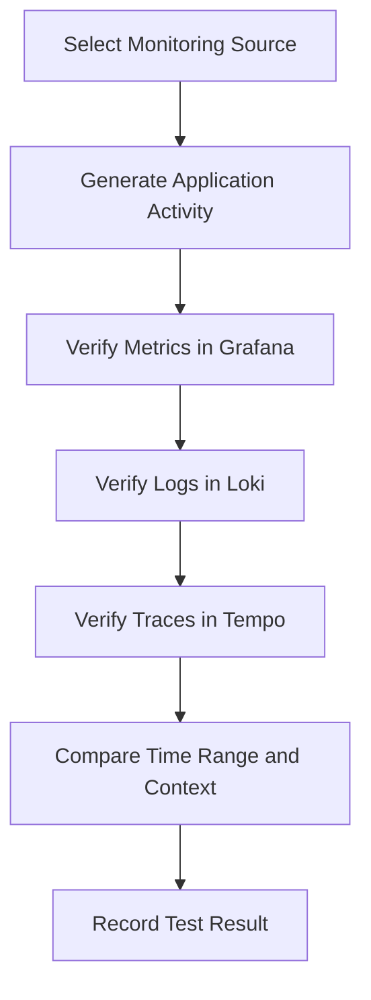
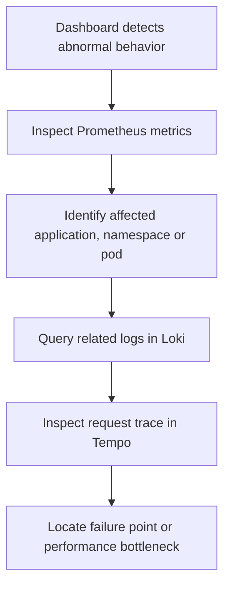

# Application Monitoring & Observability｜應用監控與可觀測性

本文件介紹應用系統監控服務的整體架構、Telemetry 類型、Grafana Dashboard，以及我在既有監控環境中負責的測試與驗證工作。

系統以 **Metrics、Logs 與 Distributed Traces** 為核心，透過 Grafana 提供統一的查詢與視覺化入口，用於觀察 Kubernetes Workload 與應用程式的資源使用、執行狀態、錯誤內容及請求路徑。

> **Public Documentation Notice｜公開文件說明**
>
> 本文件僅描述抽象化的監控架構與測試經驗，不包含實際 Cluster Name、Namespace、Service Name、Dashboard URL、Data Source Endpoint、Credential、Token、Alert Rule 或其他環境識別資訊。

---

# Documentation Navigation｜文件導覽

- [Project Overview｜專案總覽](./README.md)
- [Frontend Development｜前端開發](./Frontend.md)
- [Backend Development｜後端開發](./Backend.md)

---

# Observability Overview｜可觀測性概述

應用系統監控服務整合三種主要 Telemetry Data：

| Telemetry | Purpose |
|---|---|
| Metrics | 觀察 CPU、Memory、Pod、Node、Restart、Request Rate 與其他數值型狀態。 |
| Logs | 查詢應用程式與 Kubernetes Workload 的事件、錯誤訊息及執行內容。 |
| Traces | 追蹤請求在不同元件或服務間的執行路徑、延遲與失敗位置。 |

Grafana 作為統一的觀測入口，整合 Metrics、Logs 與 Traces，讓使用者可以從 Dashboard 發現異常，再進一步查詢相關 Log 或 Trace。

---

# Scope and Responsibility｜工作範圍與責任

此監控環境的主要元件與基礎設定已由團隊主管完成安裝與配置。

我在此項目中主要負責：

- 驗證 Grafana Dashboard 是否能正常呈現 Kubernetes 與 Node Metrics。
- 測試 Metrics、Logs 與 Traces 是否能從對應的 Observability Backend 查詢。
- 檢查監控來源、Telemetry Pipeline 與 Dashboard 顯示結果是否符合需求。
- 協助確認 Kubernetes 與非 Kubernetes 應用程式監控流程。
- 整理測試結果、操作方式與後續教育訓練所需資訊。

因此，本文件不將監控平台的安裝與基礎建置列為我的主要實作成果，而是聚焦於 **Observability Verification、Dashboard Validation 與 Application Monitoring Testing**。

---

# Requirement Summary｜需求摘要

客戶需求包含：

- 建立可收集 Distributed Traces、Metrics 與 Logs 的應用系統監控服務。
- 安裝並配置 Observability Backend 與 Grafana Dashboard。
- 分別以 Kubernetes 與非 Kubernetes 環境中的應用程式作為監控來源。
- 提供監控元件安裝、配置及操作相關的教育訓練。

在目前的工作分工中，監控平台的安裝與配置由團隊既有環境提供，我負責針對上述需求進行功能測試與驗證。

---

# Technology Stack｜技術棧

| Component | Responsibility |
|---|---|
| Grafana | 統一呈現 Metrics、Logs、Traces 與 Kubernetes Dashboard。 |
| Prometheus | 保存與查詢 Kubernetes、Node 與 Application Metrics。 |
| Loki | 集中查詢應用程式與 Kubernetes Logs。 |
| Tempo | 保存與查詢 Distributed Traces。 |
| OpenTelemetry / Odigos | 收集應用程式 Telemetry，並轉送至對應的 Observability Backend。 |
| Kubernetes Monitoring Mixins | 提供 Cluster、Node、Namespace、Pod、Workload 與 Networking Dashboard。 |

---

# Overall Observability Architecture｜整體可觀測性架構

這套架構將 Telemetry Collection 與資料儲存、查詢及視覺化分開：

- Application 或 Kubernetes Workload 是監控來源。
- OpenTelemetry／Odigos 負責收集並轉送 Telemetry。
- Prometheus、Loki 與 Tempo 分別處理 Metrics、Logs 與 Traces。
- Grafana 統一提供 Dashboard、查詢與問題分析入口。

---

# Telemetry Relationship｜Telemetry 關係

三種 Telemetry 解決不同問題：

- Metrics 適合快速發現異常趨勢與資源壓力。
- Logs 提供事件發生時的詳細上下文。
- Traces 用於確認請求經過哪些元件，以及延遲或錯誤出現的位置。

---

# Grafana Dashboard Verification｜Grafana 儀表板驗證

目前 Grafana 已提供 Kubernetes 與 Node Exporter 相關 Dashboard，包含：

- Kubernetes API Server
- Cluster Compute Resources
- Namespace Compute Resources
- Node Compute Resources
- Pod and Workload Resources
- Kubernetes Networking
- Persistent Volumes
- Scheduler、Controller Manager、Kubelet 與 Proxy
- Node Exporter Overview and USE Method

這些 Dashboard 主要來自 Kubernetes Mixin 與 Node Exporter Mixin，可用於從 Cluster、Node、Namespace、Pod、Workload 與 Networking 等不同層級觀察系統狀態。

<!--
Replace the following placeholder with the GitHub attachment URL after uploading the screenshot.

*Grafana Dashboard List｜Kubernetes Mixin 與 Node Exporter Mixin 提供 Cluster、Node、Namespace、Pod 與 Networking 等監控視角。*
-->

---

# Metrics Monitoring｜指標監控

Metrics 測試主要確認 Grafana 能否正確呈現 Kubernetes 與 Node 的數值型狀態。

主要觀察範圍包括：

- Cluster、Node、Namespace、Pod 與 Workload 狀態。
- CPU 與 Memory Usage。
- Pod Restart Count 與 Workload Availability。
- Network Traffic 與 Resource Saturation。
- Persistent Volume 與 Kubernetes Control Plane 指標。

測試時會確認：

- Dashboard 是否能正常載入。
- 查詢時間範圍改變後資料是否同步更新。
- 不同 Cluster Resource 層級是否能取得對應指標。
- Dashboard Variable 與 Filter 是否能切換到正確的監控目標。
- 異常數值是否能進一步定位到相關 Namespace、Pod 或 Workload。

---

# Log Monitoring｜日誌監控

Loki 用於集中查詢 Application 與 Kubernetes Logs。

Log 測試重點包括：

- 是否能依時間範圍查詢 Log。
- 是否能依 Application、Namespace、Pod 或其他 Label 篩選。
- 應用程式產生的測試 Log 是否能被收集與查詢。
- Error Log 是否保留足夠的執行上下文。
- Grafana Explore 是否能從 Dashboard 進一步切換到相關 Log 查詢。

---

# Distributed Tracing｜分散式追蹤

Tempo 用於保存 Distributed Traces，協助分析 Application Request Flow。

Trace 測試重點包括：

- 應用程式是否能產生 Trace 與 Span。
- Trace 是否能被 Telemetry Pipeline 收集並送入 Tempo。
- Grafana 是否能查詢 Trace Detail。
- Span 是否包含服務名稱、執行時間、上下游關係與錯誤狀態。
- 是否能從高延遲或錯誤請求定位到實際發生問題的 Span。

---

# Kubernetes and Non-Kubernetes Sources｜Kubernetes 與非 Kubernetes 監控來源

客戶需求要求監控來源同時涵蓋 Kubernetes 與非 Kubernetes 環境。

| Source Type | Verification Focus |
|---|---|
| Kubernetes Application | Workload、Pod、Container、Namespace、Metrics、Logs 與 Trace 可見性。 |
| Non-Kubernetes Application | Application Agent／Collector、Host Context、Metrics、Logs 與 Trace 傳輸。 |

兩種來源的部署方式與執行環境不同，但最終都會將 Telemetry 傳送至相同的 Observability Backend，並由 Grafana 提供一致的查詢介面。

> **Implementation Status Note｜實作狀態說明**
>
> 此章節描述需求與測試方向。正式公開前，應再依實際完成的測試案例補上應用程式類型、驗證範圍與測試結果，避免將尚未完成的項目描述為已完整驗證。

---

# Validation Workflow｜測試與驗證流程

測試流程不是只確認 Dashboard 能開啟，而是確認從應用程式活動到 Telemetry 查詢的完整鏈路：

1. 選擇 Kubernetes 或非 Kubernetes 監控來源。
2. 透過測試請求或應用程式操作產生可觀察活動。
3. 在 Grafana Dashboard 驗證 Metrics。
4. 在 Loki 查詢相同時間範圍的 Logs。
5. 在 Tempo 檢查對應的 Trace 與 Span。
6. 比對時間、服務、Pod 或其他 Context 是否一致。
7. 記錄成功、失敗與待調整項目。

---

# Troubleshooting Workflow｜問題分析流程

Metrics、Logs 與 Traces 並不是三個互相獨立的畫面，而是問題分析時逐步縮小範圍的工具：

- 先由 Dashboard 找到異常時間與受影響資源。
- 使用 Logs 取得錯誤訊息與事件上下文。
- 使用 Trace 分析請求路徑、延遲與失敗位置。

---

# Observability Engineering Decisions｜可觀測性工程設計

- **Unified visualization through Grafana**  
  Metrics、Logs 與 Traces 使用相同的觀測入口，降低切換不同工具的操作成本。

- **Telemetry backend separation**  
  Prometheus、Loki 與 Tempo 分別處理適合自己的資料類型，避免將不同 Telemetry 強制放入單一儲存模型。

- **Environment-independent observability model**  
  Kubernetes 與非 Kubernetes Application 使用不同的收集方式，但共用 Metrics、Logs、Traces 與 Grafana 的觀測模型。

- **Context-based troubleshooting**  
  透過時間範圍、Application、Namespace、Pod、Workload 與 Trace Context 關聯不同 Telemetry。

- **Verification separated from platform installation**  
  安裝配置與功能驗證屬於不同責任，本文件只將實際參與的測試與驗證工作列為個人貢獻。

---

# Engineering Challenges｜工程挑戰

| Challenge | Approach |
|---|---|
| 三種 Telemetry 使用不同的資料模型 | 分別驗證 Prometheus、Loki 與 Tempo，再透過 Grafana 建立一致的查詢入口。 |
| Kubernetes 資源層級較多 | 依 Cluster、Node、Namespace、Pod 與 Workload 層級逐步確認 Dashboard 與 Filter。 |
| Dashboard 有資料不代表完整鏈路正常 | 透過測試請求同時比對 Metrics、Logs、Traces 與時間範圍。 |
| Kubernetes 與非 Kubernetes 收集方式不同 | 使用一致的驗證項目比較兩種來源的 Telemetry 可見性。 |
| 容易將既有平台建置誤寫成個人實作 | 清楚區分 Platform Installation、Configuration 與 Testing Responsibility。 |

---

# Observability Contributions｜可觀測性相關貢獻

我在此項目中的主要工作包括：

- 測試既有 Grafana、Prometheus、Loki 與 Tempo 監控環境。
- 驗證 Kubernetes Mixin 與 Node Exporter Mixin Dashboard 的資料呈現。
- 依 Cluster、Node、Namespace、Pod、Workload 與 Networking 等不同層級檢查 Metrics。
- 測試 Application Log 是否能被 Loki 收集與查詢。
- 測試 Distributed Trace 是否能在 Tempo 與 Grafana 中查詢。
- 協助驗證 Kubernetes 與非 Kubernetes Application 的監控來源。
- 整理監控測試流程、結果與教育訓練所需操作資訊。

> 上述內容應依最終實際完成的測試範圍保留或調整；尚未完成驗證的項目不應在公開文件中描述為已完成成果。

---

# What I Learned｜開發經驗

透過此項目，我開始從 Metrics、Logs 與 Traces 三個角度理解應用程式的執行狀態，而不只依賴單一 Log File 判斷問題。

我也理解到 Grafana 主要負責統一呈現與查詢，實際資料則由 Prometheus、Loki 與 Tempo 分別保存。當系統發生異常時，Metrics 適合用來發現問題範圍，Logs 提供錯誤上下文，Traces 則能呈現請求路徑與效能瓶頸。

此項目也讓我累積了 Kubernetes Dashboard Validation、Telemetry Pipeline Verification，以及在既有平台環境中進行功能測試與問題定位的經驗。

This work demonstrates practical experience in observability testing, Kubernetes monitoring, Grafana dashboard validation, and Metrics, Logs, and Distributed Traces verification.

本項工作展示了 Observability Testing、Kubernetes Monitoring、Grafana Dashboard Validation，以及 Metrics、Logs 與 Distributed Traces 驗證等實務經驗。
