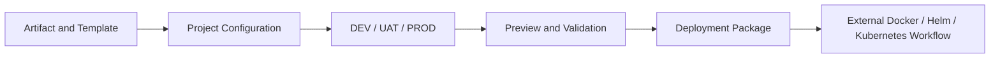

# K8s Deploy Tool｜Kubernetes CI/CD Platform

A full-stack Kubernetes CI/CD management platform for managing deployment resources, environment configuration, and deployment package generation.

一套全端 Kubernetes CI/CD 管理平台，整合 **Artifact、Template、Project Configuration、Registry Workflow 與 Deployment Package Generation**，讓不同專案可以透過一致的方式管理版本、環境設定與部署資產。

> **Repository Notice｜Repository 說明**
>
> 本 Repository 著重於系統架構、工程設計與開發經驗。公開文件不包含 Credential、內部 Endpoint、Registry Host、Cluster Address、Namespace、Storage Path 或其他環境識別資訊。

---

# Documentation｜詳細文件

| Document | Content |
|---|---|
| [Frontend Development｜前端開發](./Frontend.md) | React 管理介面、Authentication、Routing、多環境設定、Deployment Preview、非同步任務與共用元件。 |
| [Backend Development｜後端開發](./Backend.md) | Spring Boot Domain Design、Project Hierarchy、Artifact / Template Version、Registry、Storage 與 Deployment Package Generation。 |
| [Application Monitoring & Observability｜應用監控與可觀測性](./Observability.md) | Grafana、Prometheus、Loki、Tempo，以及 Metrics、Logs、Traces 的測試與驗證經驗。 |

---

# Project Overview｜專案簡介

平台將 Kubernetes 部署流程中分散的資源集中管理，包括：

- Registry 與 OCI Artifact
- Helm、Dockerfile、Shell Template
- Project Group 與 Project Hierarchy
- DEV、UAT、PROD 多環境設定
- Project Files、Values 與 Base Image
- Deployment Asset Preview
- Deployment Package 與執行歷史
- Kubernetes Workload Image Usage

使用者可以先建立 Project，選擇受管理的 Artifact 與 Template Version，再依環境設定 Values、Config Files 與 Base Image。平台會由後端完成驗證與部署資產渲染，最後產生可下載、可追蹤的 Deployment Package。

---

# Workflow｜主要流程

> 在本平台中，**Deploy 代表產生 Deployment Package**。後端目前不會直接執行 `kubectl apply` 或 `helm install`；實際部署由產出的 Package 在平台外執行。

---

# Core Features｜核心功能

| Area | Description |
|---|---|
| Artifact and Registry | 管理 OCI Artifact、Tag、Digest、Platform 與 Registry Synchronization。 |
| Template | 管理 Public Template、Project Custom Template 與不同版本。 |
| Project | 管理 Project Group、Single-module、Multi-module 與多環境設定。 |
| Deployment | 預覽 Helm、Dockerfile、Shell Asset，並產生 Deployment Package。 |
| Task and History | 追蹤 Registry Push、Package Generation、錯誤、Retry 與執行結果。 |
| Image Management | 查詢 Kubernetes Workload Image Usage，並比對平台管理版本。 |

---

# Technology Stack｜技術棧

| Area | Technologies |
|---|---|
| Frontend | React、TypeScript、Vite、React Router、Axios |
| Backend | Java、Spring Boot、Spring Security、Spring Data JPA |
| Data and Storage | MySQL、Binary File Storage |
| Identity | Keycloak、OAuth 2.0、OpenID Connect、JWT |
| Registry and Deployment | Harbor、OCI、Docker、Helm、Kubernetes |
| Observability | Grafana、Prometheus、Loki、Tempo、Odigos |
