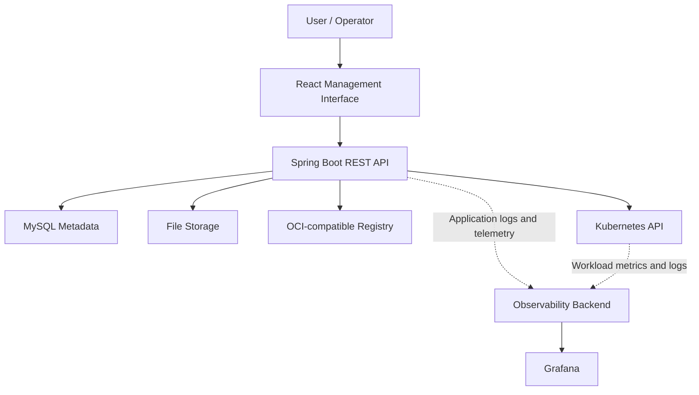
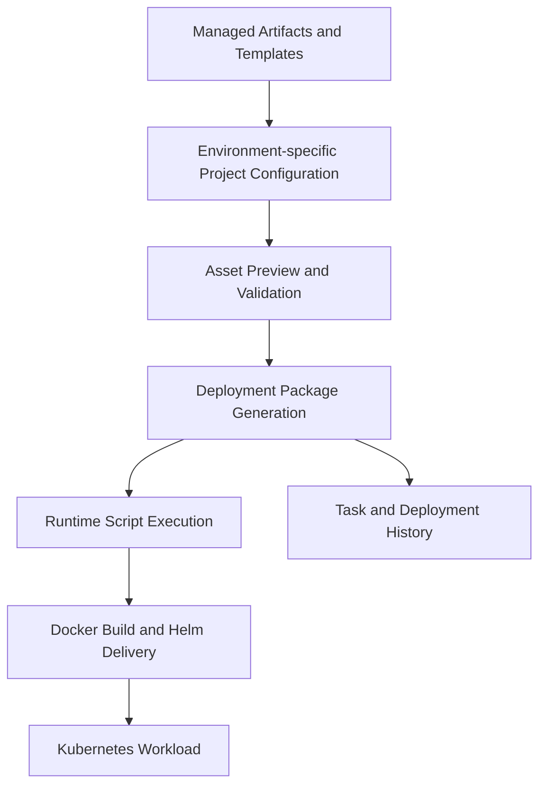

# K8s Deploy Tool｜Kubernetes CI/CD Platform

A full-stack Kubernetes CI/CD management platform designed to standardize artifact management, template versioning, multi-environment configuration, deployment package generation, and Kubernetes delivery workflows.

一套全端 Kubernetes CI/CD 管理平台，整合 **Artifact、Template、Project Configuration、Deployment Package** 與 **Kubernetes Deployment Workflow**，提供版本化、可追蹤且支援多環境的部署流程。

> **Repository Notice｜Repository 說明**
>
> This repository focuses on software architecture, engineering decisions, and implementation experience. Public documentation uses abstract examples and omits credentials, internal endpoints, registry hosts, storage paths, namespaces, and other environment-specific identifiers.
>
> 本 Repository 著重於系統架構、工程設計與開發經驗分享。公開文件使用抽象化範例，並省略 Credential、內部 Endpoint、Registry Host、Storage Path、Namespace 與其他環境識別資訊。

---

# Documentation｜詳細文件

- [Frontend Development｜前端開發](./Frontend.md)  
  介紹前端整體架構、Authentication、Routing、API Data Flow、多環境設定、Deployment 操作流程、非同步任務 UI、共用元件與互動設計。

- [Backend Development｜後端開發](./Backend.md)  
  介紹後端分層架構、Domain Module、Artifact 與 Template Version Management、Project Configuration、Deployment Package Generation、Registry / Kubernetes 整合、Storage Abstraction 與資料一致性設計。

- [Application Monitoring & Observability｜應用監控與可觀測性](./Observability.md)  
  介紹 Metrics、Logs 與 Distributed Tracing 的整合方式，以及 OpenTelemetry、Odigos、Prometheus、Loki、Tempo、Grafana、Audit Logging 與 Kubernetes 應用監控架構。

---

# Project Overview｜專案簡介

平台目標是將分散的 Artifact、Template、Environment Configuration 與 Kubernetes Delivery Process 整合成統一的管理流程，讓不同 Project 與 Runtime 的服務能夠透過相同介面完成版本選擇、部署資產預覽、套件產生與交付操作。

平台將 Artifact 與 Template 集中管理，搭配各 Project 在 DEV、UAT、PROD 中獨立保存的設定，產生可追蹤、可重現的 Deployment Package。產出的 Runtime Assets 可進一步支援 Docker Image Build 與 Helm-based Kubernetes Deployment Workflow。

整體設計以以下原則為核心：

- **Version Management｜版本管理**：Artifact 與 Template 以版本為操作單位，保留可追蹤的部署來源。
- **Environment Isolation｜環境隔離**：DEV、UAT、PROD 分別保存 Template、Values、Config 與 Base Image 選擇。
- **Deployment Reproducibility｜部署可重現性**：將選定版本與環境設定渲染為結構一致的 Deployment Package。
- **Storage Abstraction｜儲存抽象化**：Metadata 與 Binary Content 分離管理，降低 Domain Logic 與實體儲存方式的耦合。
- **Operational Traceability｜操作可追蹤性**：使用 Task State、Deployment History、Persistent Log 與 Audit Log 記錄長時間操作及重要行為。

---

# Core Capabilities｜核心功能

| Capability | Description |
|---|---|
| Registry and Artifact Management | 管理 Registry、OCI Artifact、Docker Image、Tag、Digest 與 Platform Metadata。 |
| Template Version Management | 管理 Helm Chart、Dockerfile 與 Shell Template，支援版本上傳、驗證、預覽與下載。 |
| Multi-environment Configuration | 依 DEV、UAT、PROD 隔離 Project Template、Values、Config Files 與 Base Image 設定。 |
| Deployment Asset Preview | 在產生套件前預覽 Rendered Helm Manifest、Dockerfile 與 Shell Script。 |
| Deployment Package Generation | 將 Artifact、Template 與環境設定組合為可下載、可追蹤的 Deployment Package。 |
| Artifact Push Tasks | 透過非同步任務執行 Registry Artifact 操作，並保存狀態、Retry 資訊與歷史紀錄。 |
| Kubernetes Image Usage Analysis | 掃描 Kubernetes Workload 使用的 Image，分析版本使用情況、Outdated Image 與 Cleanup Candidate。 |
| Authentication and Authorization | 使用 OAuth 2.0 / OpenID Connect、PKCE 與 Role-based Access Control 保護前後端操作。 |
| Audit and Observability Integration | 透過 Audit Logging、Metrics、Logs 與 Traces 提供系統操作及執行狀態的可觀測性。 |

---

# Architecture Summary｜架構摘要

前端將 Registry、Artifact、Template、Project 與 Deployment 等功能轉換成一致的管理流程；後端負責 Authentication、Validation、Version Resolution、Asset Rendering、Task Processing、Storage 與外部系統整合。

MySQL 保存 Domain Metadata 與操作狀態，Binary Content 與產生的 Deployment Package 則交由 Storage Service 管理。Registry 與 Kubernetes Integration 分別負責 Artifact Workflow 與 Workload Image Usage Analysis。

Observability Backend 代表外部整合的 Prometheus、Loki 與 Tempo 等服務，並由 Grafana 提供統一查詢與視覺化入口。

---

# Deployment Workflow｜部署流程

1. 管理者選擇平台內已管理的 Artifact、Template 與對應版本。
2. Project Configuration 依 DEV、UAT、PROD 保存不同環境的部署設定。
3. 平台在產生套件前驗證選擇內容，並提供 Helm、Dockerfile 與 Shell Asset Preview。
4. 後端將選定資源渲染並封裝為 Deployment Package，同時記錄產生狀態與結果。
5. 套件內的 Runtime Scripts 支援後續 Docker Image Build、Helm Install / Upgrade 與 Kubernetes Delivery Workflow。

---

# Technology Stack｜技術棧

| Area | Technologies |
|---|---|
| Frontend | React , TypeScript, Vite, React Router, Axios, Zustand, Bootstrap |
| Backend | Java , Spring Boot , Spring MVC, Spring Data JPA, Spring Security |
| Data and Storage | MySQL, File Storage Abstraction |
| Authentication | OAuth 2.0, OpenID Connect, Authorization Code with PKCE, JWT Role Authorization |
| Artifact and Registry | OCI-compatible Registry, OCI Artifact and Multi-platform Image Operations |
| Deployment | Docker, Helm, Kubernetes |
| Observability Integration | OpenTelemetry, Odigos, Prometheus, Loki, Tempo, Grafana |

---

# Key Engineering Decisions｜主要設計決策

- **Version-based Resource Model**  
  Artifact 與 Template 採用版本化管理，而不是直接覆蓋既有內容，使 Project Configuration 與 Deployment History 能追蹤實際使用的版本。

- **Environment-specific Configuration**  
  DEV、UAT、PROD 各自保存 Project Selected Configuration，避免不同環境共用同一組可變設定。

- **Runtime-aware Template Validation**  
  不同 Runtime 與 Package Type 使用對應的 Dockerfile Template Metadata 與 Validation Rule，避免以單一通用模板承擔所有部署情境。

- **Separation of Internal Storage and Runtime Package**  
  平台內部 Storage Layout 用於版本與檔案管理；對外產生的 Deployment Package 則依執行需求重新組裝，不讓內部儲存結構限制 Runtime Scripts。

- **Metadata and Binary Separation**  
  Database 保存 Artifact、Version、Task 與 Deployment Metadata；Template Bundle、Uploaded File 與 Generated Package 交由 Storage Service 管理。

- **Controlled Base Image Selection**  
  Docker Base Image 從平台管理且狀態有效的 Artifact Version 中選擇，降低使用未受控 Image Reference 的風險。

- **Preview before Package Generation**  
  在建立 Deployment Package 前提供 Helm Manifest、Dockerfile 與 Shell Script Preview，使使用者能先確認渲染結果。

- **Persistent Asynchronous Task State**  
  Deployment Package 與 Registry Artifact 等長時間操作透過 Task State、Persistent Log、Retry 與 Startup Recovery 管理，避免只依賴前端連線或記憶體狀態。

- **Audit Logging without Request Bodies**  
  Audit Log 記錄重要 API 操作的 Method、Path、Status、Duration 與使用者資訊，但不寫入 Request Body，以降低 Credential、Token 或設定內容進入 Log 的風險。

---

# My Contributions｜我的主要貢獻

I participated in the full-stack design and implementation of the platform, covering frontend management workflows, backend domain services, deployment package generation, registry integration, Kubernetes integration, and observability.

我參與了平台的全端設計與實作，涵蓋前端管理流程、後端領域服務、Deployment Package Generation、Registry Integration、Kubernetes Integration 與 Observability。

主要參與內容包括：

- 使用 Java、Spring Boot 與 MySQL 設計並實作 Registry、Artifact、Template、Project、Deployment 與 Image Management 等 RESTful API。
- 使用 React 與 TypeScript 開發管理介面，建立 Routing、Role Guard、API Layer、共用元件以及 Loading / Error State 處理。
- 參與 Artifact、Template Version、Platform Metadata、Task 與 Deployment History 的資料模型及版本管理設計。
- 實作 DEV、UAT、PROD 多環境 Project Configuration，以及 Template、Values、Config Files 與 Base Image 的選擇流程。
- 實作 Deployment Asset Preview 與 Deployment Package Generation，將多種部署資源渲染為結構一致的 Runtime Package。
- 參與 OCI Artifact Promotion、Multi-platform Image Operation、Digest / Platform Metadata Persistence 與 Artifact Push Task Workflow。
- 參與 Kubernetes Workload Image Usage Scanning、Outdated Image Analysis 與 Cleanup Candidate Analysis。
- 參與 OAuth 2.0 / OpenID Connect Authentication、JWT Role Authorization 與前端 Route Protection。
- 參與非同步 Task、Retry、Startup Recovery、Persistent History 與錯誤處理機制的設計及重構。
- 整合 Audit Logging 與 Metrics、Logs、Distributed Tracing 等 Observability Workflow。

---

This project demonstrates practical experience in full-stack platform development, version-based deployment resource management, cloud-native integration, asynchronous workflow design, and application observability.

本專案展示了全端平台開發、版本化部署資源管理、Cloud-native Integration、非同步工作流程設計與應用程式可觀測性的實作經驗。
