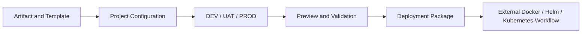

# K8s Deploy Tool｜Kubernetes CI/CD Platform

A full-stack Kubernetes CI/CD platform for managing deployment resources, project access, environment configuration, and deployment package generation.

一套全端 Kubernetes CI/CD 平台，整合 **Artifact、Template、Project Configuration、Member Management、Registry Workflow** 與 **Deployment Package Generation**，提供一致且可追蹤的部署資源、權限與環境管理流程。

> **Repository Notice｜Repository 說明**
>
> 本 Repository 著重於系統架構、工程設計與開發經驗。公開文件不包含 Credential、內部 Endpoint、Registry Host、Cluster Address、Namespace、Storage Path 或其他環境識別資訊。

---

# Documentation｜詳細文件

| Document | Content |
|---|---|
| [Frontend Development｜前端開發](./Frontend.md) | React 管理介面、Authentication、Routing、多環境設定、Deployment Preview、非同步任務與共用元件。 |
| [Backend Development｜後端開發](./Backend.md) | Spring Boot Domain Design、Member Management、Project Access Control、Project Hierarchy、Artifact / Template Version、Registry、Storage 與 Deployment Package Generation。 |
| [Application Monitoring & Observability｜應用監控與可觀測性](./Observability.md) | Grafana、Prometheus、Loki、Tempo，以及 Metrics、Logs、Traces 的測試與驗證經驗。 |

---

# Project Overview｜專案簡介

平台將 Kubernetes 部署所需的資源、環境設定、權限與部署流程集中管理，提供一致且可追蹤的部署工作流程，包括：

- Member Management
- Role-based Authorization
- Project Access Control
- Registry and OCI Artifact
- Helm、Dockerfile and Shell Template
- Project Group and Project Hierarchy
- DEV、UAT、PROD Environment Configuration
- Project Files、Values and Base Image
- Deployment Asset Preview
- Deployment Package Generation and History
- Kubernetes Workload Image Usage

使用者可以建立 Project，選擇受管理的 Artifact 與 Template Version，並依不同環境設定 Values、Project Files 與 Base Image。平台會完成驗證、部署資產渲染與 Package Generation，產生可下載、可追蹤的 Deployment Package。

---

# Workflow｜主要流程

```mermaid
flowchart LR
    A["Artifact and Template"] --> B["Project Configuration"]
    B --> C["DEV / UAT / PROD"]
    C --> D["Preview and Validation"]
    D --> E["Deployment Package"]
    E --> F["External Docker / Helm / Kubernetes Workflow"]
```

> 在本平台中，**Deploy** 代表產生 Deployment Package。後端目前不會直接執行 `kubectl apply` 或 `helm install`；實際部署由產出的 Package 在平台外執行。

---

# Core Features｜核心功能

| Area | Description |
|---|---|
| Member Management | Synchronize Keycloak users, manage platform members, roles and project access permissions. |
| Artifact and Registry | Manage OCI artifacts, image versions, registry synchronization and metadata. |
| Template | Manage public templates, project custom templates and template versions. |
| Project | Manage project groups, project hierarchy and multi-environment configurations. |
| Deployment | Preview deployment assets and generate versioned deployment packages. |
| Task and History | Track package generation, registry tasks, execution history and retry status. |
| Image Management | Discover Kubernetes workload images and compare managed artifact versions. |

---

# Technology Stack｜技術棧

| Area | Technologies |
|---|---|
| Frontend | React、TypeScript、Vite、React Router、Axios |
| Backend | Java、Spring Boot、Spring Security、Spring Data JPA |
| Data and Storage | MySQL、Binary File Storage |
| Identity | Keycloak、OAuth 2.0、OpenID Connect、JWT |
| Registry and Deployment | Harbor、OCI、Docker、Helm、Kubernetes |
| Observability | Grafana、Prometheus、Loki、Tempo、Odigos |
